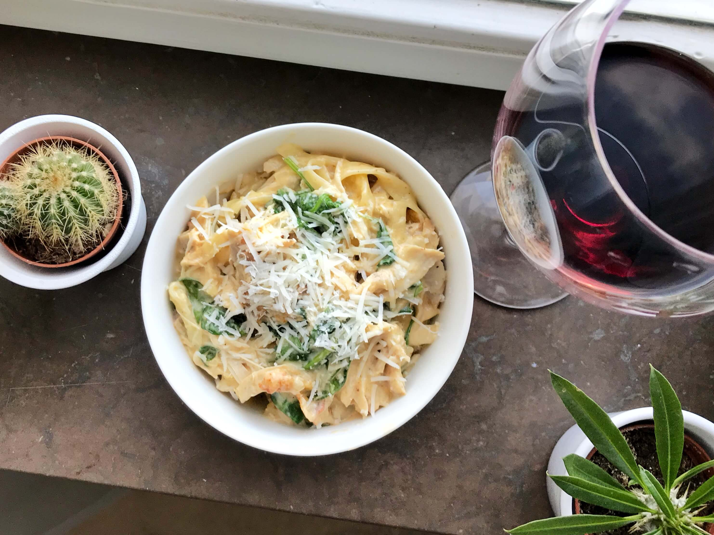

# Maträtter

- [Chicken alfredo](#alfredo)
- [Amerikanska pannkakor](#pancakes)
---

## Chicken alfredo

### Ingredienser
- 1 grillad kykling
- 5 dl vispgrädde
- 5 dl vatten
- 1 gul lök
- 3 klyftor vitlök
- 1 påse spenat
- hönsbuljong
- grönsaksbuljong
- tagliatelle

### Do dis
1. Hacka och fräs löken i en kastrull
1. Häll i vispgrädde, vatten och täck botten med tagliatelle
1. Låt koka tills pastan är klar
1. Tillsätt buljongtärningarna, vitlöken, salt och peppar
1. Riv sönder kyklingen och mixa allt tillsammans med spenaten
___

## Amerikanska pannkakor
### Ingredienser
- 2.5 dl mjöl
- 2 msk socker
- 2 tsk bakpulver
- 2 dl mjölk
- 2 msk smör
- 1 ägg